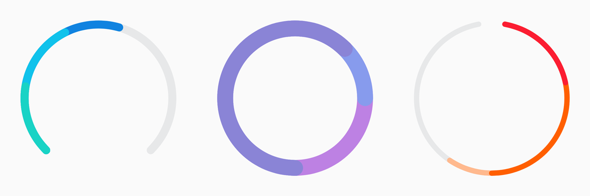
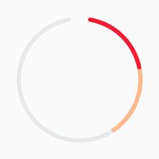
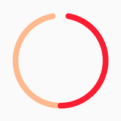
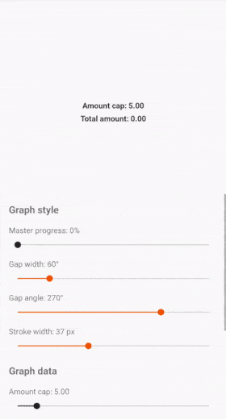

[ ](https://bintray.com/thefuntastyops/donut/donut/_latestVersion)
[](https://app.bitrise.io/app/e9f4fbbcc143c212)

# Donut 🍩
`DonutProgressView` is a configurable doughnut-like graph view capable of displaying multiple datasets with assignable colors. It supports animations and features a gap at the top, which makes it look like a gauge (or tasty bitten-off donut - that's why the name).



The view automatically scales it's datasets proportionally to their values once it gets filled up. This allows you to show your users their daily progresses, reached goals, etc.  

## How to use
Place the view in your layout

```xml
<app.futured.donut.DonutProgressView
    android:id="@+id/donut_view"
    android:layout_width="wrap_content"
    android:layout_height="wrap_content"
    app:donut_bgLineColor="@color/cloud"
    app:donut_gapWidth="20"
    app:donut_gapAngle="270"
    app:donut_strokeWidth="16dp"/>
```

Submit data to the view

```kotlin
val dataset1 = DonutDataset(
    name = "dataset_1",
    color = Color.parseColor("#FB1D32"),
    amount = 1f
)

val dataset2 = DonutDataset(
    name = "dataset_2",
    color = Color.parseColor("#FFB98E"),
    amount = 1f
)

donut_view.cap = 5f
donut_view.submitData(listOf(dataset1, dataset2))
```

You'll get something like this:



### About the data cap
Once the sum of all dataset values exceeds view's `cap` property, the view starts to scale it's datasets proportionally to their amounts along it's length. E.g. if we, in the upper example, set cap to `donut_view.cap = 1f` (`dataset1.amount + dataset2.amount > 1f`), we would get something like this:



## Submitting data
The view accepts list of `DonutDataset` objects that define data to be displayed.  
Each `DonutDataset` object holds dataset's unique name (string), it's color (color int) and dataset's value. *(Note: the view uses unique name for each dataset to resolve it's internal state and animations, and throws `IllegalStateException` if multiple datasets with same name are submitted.)*

```kotlin
val waterAmount = DonutDataset(
    name = "drink_amount_water",
    color = Color.parseColor("#03BFFA"),
    amount = 1.2f
)
```

You have to submit new list of datasets everytime you want to modify displayed data, as `DonutDataset` object is immutable.

```kotlin
donut_view.submitData(listOf(waterAmount))
```

### Granular controls

The view also provides methods for more granular control over displayed data. You can use `addAmount` and `removeAmount` methods to add or remove specified amounts from displayed datasets.  

#### Adding amount

```kotlin
donut_view.addAmount(
    datasetName = "drink_amount_water",
    amount = 0.5f,
    color = Color.parseColor("#03BFFA") // Optional, pass color if you want to create new dataset
)
```

The `addAmount` adds specified amount to dataset with provided name. What if dataset does not yet exist? This method has one optional `color` parameter (default value is `null`) - when called, and there isn't already displayed any dataset with provided name and `color` parameter was specified, the new `DonutDataset` with provided name, amount and color will be automatically created internally for you. If you leave the `color` param `null` while trying to add value to non-existent dataset, nothing happens.

#### Removing amount

```kotlin
donut_view.removeAmount(
    datasetName = "drink_amount_water",
    amount = 0.1f
)
```

The `removeAmount` simply subtracts specified amount from any displayed dataset. If resulting amount is equal or less than 0, dataset and corresponding progress line are automatically removed after animation. If view does not contain specified dataset, nothing happens.

### Get and clear data

If you want to get currently displayed data, call `getData()` method which returns immutable list of all displayed `DonutDataset` objects. To clear displayed data, call `clear()` method.

Each call to a data method (submit, add, remove, clear) results in view **automatically resolving and animating to the new state**.

## Customization
The view allows you to configure various properties to let you create a unique style that fits your needs. They can be changed either via XML attributes, or at runtime via property access.

### XML attributes
|Name|Default value|Description|
|---|---|---|
| `donut_cap`| `1.0f` | View's cap property |
| `donut_strokeWidth` | `12dp` | Width of background and dataset lines in dp |
| `donut_bgLineColor`| `#e7e8e9` | Color of background line |
| `donut_gapWidth` | `45°` | Width of the line gap in degrees |
| `donut_gapAngle` | `90°` | Position of the line gap around the view in degrees |
| `donut_animateChanges` | `true` | Animation enabled flag, if `true`, the view will animate it's state changes (enabled by default) |
| `donut_animationInterpolator` | `DecelerateInterpolator` | Interpolator to be used in state change animations |
| `donut_animationDuration` | `1000 ms` | Duration of state change animations in ms |

In addition to these XML attributes, the view features `masterProgress` property (`0f to 1f`) that can be changed programatically. It controls percentual progress of all lines, including the background line, which allows you to get creative with startup animations, etc.

### Sample app

The quickest way to explore different styles is to try the [sample](sample/) app, which contains an interactive playground with buttons and sliders to fiddle with.




## Download
`build.gradle`:

```groovy
allprojects {
    repositories {
        jcenter()
    }
}
```

`module/build.gradle`:

```groovy
dependencies {
    implementation("app.futured.donut:library:$version")
}
```
---
Made with 🖤 in [Futured](http://futured.app)
